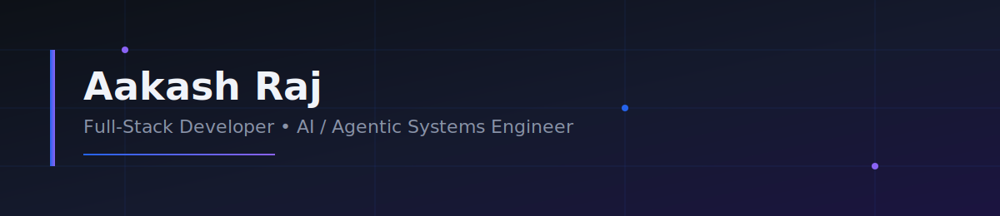
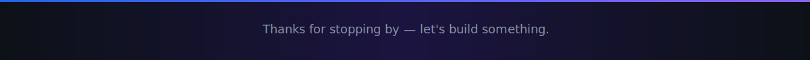

<div align="center">

<!-- ================= HERO BANNER ================= -->


<!-- ================= TYPING ANIMATION ================= -->
<a href="#">
  
</a>

<br/>

<!-- ================= SOCIAL / CONTACT BADGES ================= -->
<p>
  <a href="mailto:aakashraj1535@gmail.com">
    
  </a>
  <a href="https://linkedin.com/in/aakash-raj-5677412b1/>
    
  </a>
  <a href="https://github.com/Aakashraj1535">
    
  </a>
  <a href="#">
    
  </a>
</p>

<!-- ================= VISITOR COUNTER ================= -->


</div>

<br/>

## About Me

```python
class AakashRaj:
    def __init__(self):
        self.role         = "IT Student · Full-Stack & AI Engineer"
        self.location     = "Chennai, India"
        self.focus        = ["Full-Stack Development", "Agentic AI Systems", "RAG Pipelines"]
        self.current_build = "Supply Chain Sentinel — Multi-Agent RAG Platform"
        self.philosophy   = "Ship real software that solves real problems."

    def currently_learning(self):
        return ["Advanced LangGraph orchestration", "Vector search optimization", "System design"]

    def collaborate_on(self):
        return ["AI agents", "RAG applications", "Full-stack products", "Open source tooling"]

me = AakashRaj()
```

I'm an Information Technology student who builds production-shaped software rather than toy demos — from role-based full-stack platforms to multi-agent AI systems that reason over real data. My work sits at the intersection of **clean full-stack engineering** and **applied AI**, with a growing focus on **agentic, retrieval-augmented systems** that are useful outside a notebook.

I care about readable architecture, honest documentation, and building things that a recruiter — or a teammate — can actually open and understand in five minutes.

<br/>

## Tech Stack

<div align="center">

**Languages**
<br/>


**Frontend**
<br/>


**Backend**
<br/>


**Database**
<br/>


**AI &amp; ML**
<br/>


**Tools**
<br/>


</div>

<br/>

## Featured Projects

<table>
<tr>
<td width="50%" valign="top">

### Supply Chain Sentinel
**AI-powered supply chain monitoring platform — current major build**

A multi-agent system that watches supply chain data, detects exceptions, and produces ranked, explainable recommendations using a local LLM and retrieval-augmented generation.

- Multi-agent workflow orchestrated with LangGraph
- RAG-based knowledge retrieval over a vector-indexed knowledge base
- Local LLM inference via Ollama (no external API dependency)
- Automated exception detection and report generation
- FastAPI backend serving a React dashboard

`React` `FastAPI` `PostgreSQL` `LangGraph` `Ollama` `pgvector`

**[View Repository →](#)**https://github.com/Aakashraj1535/Sentinel

</td>
<td width="50%" valign="top">

### College Complaint Management System
**Full-stack complaint tracking platform for institutions**

A role-based web platform that lets students submit and track complaints while giving admins a real-time dashboard to manage and resolve them.

- Role-based authentication (student / faculty / admin)
- End-to-end complaint lifecycle with status tracking
- Admin dashboard with live status updates
- Fully responsive, accessible UI

`React` `FastAPI` `PostgreSQL` `Supabase` `Tailwind CSS`

**[View Repository →](#)**https://github.com/Aakashraj1535/college-complaint-management-system

</td>
</tr>
</table>

<br/>

## Internship Experience

<table>
<tr>
<td width="50%" valign="top">

**Web Development Intern**

- Designed and developed a responsive company website end-to-end
- Improved SEO rankings by implementing on-page SEO best practices
- Optimized site performance and overall user experience
- Collaborated with the team to strengthen the company's online presence

</td>
<td width="50%" valign="top">

**Web Developer Intern — Palamuti**

- Designed and built the company's official website
- Built reusable, responsive UI components
- Worked directly with stakeholders to translate business requirements into features
- Project currently in active development, pre-deployment

</td>
</tr>
</table>

<br/>

## GitHub Analytics

<div align="center">


<br/>


<br/>


</div>

<br/>

<div align="center">

### Trophy Case


</div>

<br/>

<div align="center">

### Contribution Snake


</div>

<br/>

## Currently Learning

<div align="center">


</div>

## Open Source Goals

- Publish **Supply Chain Sentinel** as a documented, self-hostable open-source reference architecture for multi-agent RAG systems
- Contribute fixes and small features to open-source LangGraph and FastAPI tooling
- Maintain clear, ATS- and recruiter-friendly documentation across all public repositories
- Write short technical breakdowns of architecture decisions for each major project

<br/>

## Get In Touch

<div align="center">

I'm open to Software Engineering and AI Engineering internships/roles, and to collaborating on full-stack or applied-AI projects.

<a href="mailto:your.email@example.com">
  
</a>
<a href="https://linkedin.com/in/your-linkedin-handle">
  
</a>

<br/><br/>



<sub>Built with intent — this profile is a living document, updated as new projects ship.</sub>

</div>
